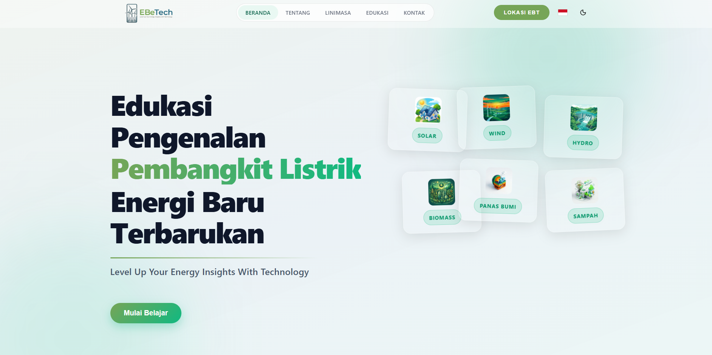

# EBeTech: Edukasi Bersama Energi Terbarukan Technology
## Institut Teknologi Perusahaan Listrik Negara
## Anggota Tim

- **Ketua :** Farhan Alam Saputra
- **Anggota 1:** Rizal Wira Pambudi
- **Anggota 2:** Ahmad Izzulkamal

## Framework yang Digunakan

- **React** — UI framework utama
- **Vite** — Build tool & dev server
- **Three.js** + **@react-three/fiber** + **@react-three/drei** — Rendering animasi 3D
- **Framer Motion** — Animasi UI & transisi halaman
- **GSAP** — Animasi lanjutan berbasis timeline
- **Leaflet** + **React Leaflet** — Peta interaktif lokasi EBT
- **Lucide React** — Library ikon

## Tampilan Beranda

> Tampilan awal halaman **Beranda** saat website dijalankan. Halaman ini menyambut pengguna dengan antarmuka modern bertema energi terbarukan, dilengkapi dengan **6 kartu visual interaktif** di sisi kanan layar yang dapat **digeser dan diletakkan bebas** ke posisi mana saja sesuai keinginan pengguna — memberikan pengalaman eksplorasi yang personal dan dinamis.

## 1. Deskripsi Proyek

**EBeTech** *(Edukasi Bersama Energi Terbarukan Technology)* adalah sebuah platform edukasi digital inovatif yang dirancang khusus sebagai pusat informasi, advokasi, dan eksplorasi energi baru terbarukan (EBT) bagi **Generation Z** dan masyarakat luas dalam mendukung transisi energi di Indonesia.

Platform ini menghadirkan konten edukasi interaktif untuk setiap jenis pembangkit listrik terbarukan (PLTA, PLTS, PLTB, PLTP, PLTBm), dilengkapi **Registry Pembangkit EBT** berisi data teknis nyata, serta **Peta Geospasial Interaktif** yang menampilkan lokasi pembangkit di seluruh nusantara — bahkan hingga skala internasional.

## 2. Latar Belakang

Pengembangan EBeTech berangkat dari beberapa kondisi nyata yang ditemukan di lapangan:

- **Minimnya Media Edukasi EBT yang Menarik** — Informasi mengenai energi terbarukan mayoritas tersaji dalam format teks ilmiah yang sulit dipahami. EBeTech hadir dengan Edukasi dan ilustrasi cara kerja pembangkit yang mudah dicerna oleh semua kalangan.

- **Kesenjangan Data & Informasi yang Terfragmentasi** — Data pembangkit EBT di Indonesia tersebar di berbagai sumber yang tidak terintegrasi. EBeTech menjawabnya dengan **Registry EBT terpusat** yang memuat data kapasitas, lokasi, dan pengelola pembangkit secara terstruktur.

- **Hambatan Persepsi terhadap EBT *(Perceived Behavioral Control)*** — Banyak masyarakat, khususnya Gen Z, yang merasa EBT adalah hal yang jauh dan tidak terjangkau. Fitur **Peta Geospasial Interaktif** EBeTech memvisualisasikan keberadaan nyata pembangkit EBT di sekitar mereka, membangun rasa kedekatan dan keyakinan bahwa transisi energi sudah berjalan.

- **Kebutuhan Sumber Informasi yang Independen & Terpercaya** — Gen Z yang kritis membutuhkan data berbasis fakta, bukan sekadar kampanye. EBeTech menyajikan informasi teknis yang transparan, termasuk koordinat lokasi, kapasitas aktual, dan tautan langsung ke peta real-time.

---

## 3. Tujuan

Tujuan utama dari pengembangan platform EBeTech ini adalah, dan berikut relevansinya dengan fitur web yang dibangun:

- **Membangun Kesadaran Energi Terbarukan** — Sesuai riset Wijaya & Kokchang (2023) bahwa *environmental awareness* adalah prediktor utama perilaku pro-EBT, EBeTech menghadirkan **halaman edukasi interaktif** dengan visualisasi 3D animasi untuk setiap jenis pembangkit (PLTA, PLTS, PLTB, PLTP, PLTBm, dll.) agar pengguna dapat memahami cara kerja EBT secara visual dan menyenangkan.

- **Menyediakan Data EBT yang Akurat & Terpercaya** — EBeTech menyajikan **Registry Pembangkit EBT** yang memuat data teknis nyata seperti kapasitas, lokasi, dan pengelola dari berbagai pembangkit listrik di seluruh Indonesia, menjadi rujukan berbasis data yang menangkal misinformasi.

- **Meningkatkan Efikasi Diri Pengguna** — Riset menunjukkan bahwa *perceived behavioral control* sangat memengaruhi niat bertindak. EBeTech menjawab ini dengan **fitur Peta Interaktif (Leaflet)** yang menampilkan lokasi pembangkit secara geospasial, membuat pengguna merasa lebih dekat dan nyata dengan keberadaan teknologi EBT di sekitar mereka.

- **Memperluas Jangkauan Literasi Digital** — Platform ini dibangun dengan teknologi *mobile-responsive* dan mendukung **bilingual (Indonesia & Inggris)**, memastikan informasi EBT dapat diakses oleh kalangan seluas-luasnya, mulai dari pelajar hingga profesional.

---

## 4. Manfaat

Manfaat EBeTech dikaitkan langsung dengan fitur-fitur yang tersedia di dalam platform:

- **Bagi Pelajar & Mahasiswa** — Dapat menggunakan **halaman edukasi EBT** sebagai sumber belajar mandiri, cara kerja, dan penjelasan teknis dari tiap jenis pembangkit listrik terbarukan.

- **Bagi Peneliti & Tenaga Pendidik** — **Fitur Registry & Peta Interaktif** menyediakan data lokasi, kapasitas, dan pengelola pembangkit EBT di Indonesia secara visual dan geospasial sebagai bahan referensi dan studi lapangan.

- **Bagi Masyarakat Umum & Gen Z** — Dengan tampilan modern, animasi transisi tema *wind turbine* dan *solar farm*, serta akses kontak langsung via WhatsApp dan Email, masyarakat dapat dengan mudah memahami dan mengajukan pertanyaan terkait EBT Dan Saran Pengembangan agar Generasi selanjutnya mengetahui perkembangan EBT tanpa hambatan teknis.

- **Bagi Lingkungan & Kebijakan** — Semakin banyak pengguna yang teredukasi melalui EBeTech, semakin besar tekanan sosial (*social norm*) yang mendorong pengambil kebijakan untuk mengakselerasi transisi energi — sejalan dengan temuan bahwa norma sosial dan kesadaran lingkungan adalah dua faktor terkuat dalam membentuk perilaku pro-EBT.

---

## 5. Pemilihan Subtema: Lingkungan

Subtema **Lingkungan** dipilih karena relevansinya yang sangat langsung dengan konten dan fitur yang diimplementasikan dalam EBeTech:

- **Urgensi Iklim sebagai Motivasi Konten** — Seluruh konten EBeTech — mulai dari halaman edukasi PLTS, PLTB, PLTA, PLTP, PLTBm, hingga registry pembangkit — berfokus pada solusi energi yang secara langsung mengurangi emisi karbon. Ini menjawab temuan riset bahwa **kesadaran lingkungan** adalah faktor paling signifikan yang mendorong niat berperilaku pro-EBT *(Wijaya & Kokchang, 2023)*.

- **Teknologi sebagai Jembatan Edukasi Lingkungan** — EBeTech membuktikan bahwa teknologi web modern (React, Three.js, Framer Motion, Leaflet) dapat menjadi alat advokasi lingkungan yang efektif. Animasi 3D interaktif dan peta geospasial mengubah data teknis yang kering menjadi pengalaman visual yang menggugah kepedulian.

- **Skala Nasional, Dampak Lokal** — Fitur **Peta Lokasi EBT** menampilkan sebaran pembangkit listrik terbarukan dari Sabang sampai Merauke, membuktikan bahwa isu lingkungan ini bukan hanya relevan di kota besar seperti Jakarta, Surabaya, atau Semarang, tetapi merupakan agenda nasional yang menyentuh setiap wilayah di Indonesia bahkan Internasional.

---

## 📚 Referensi

> **Sumber Riset :**
> *Factors Influencing Generation Z's Pro-Environmental Behavior towards Indonesia's Energy Transition*
> **Divine Ifransca Wijaya & Phimsupha Kokchang**
> 📄 [https://www.mdpi.com/2071-1050/15/18/13485](https://www.mdpi.com/2071-1050/15/18/13485)

---

## 🔗 Link Website

🌐 [https://ebetech.web.id/](https://ebetech.web.id/)

