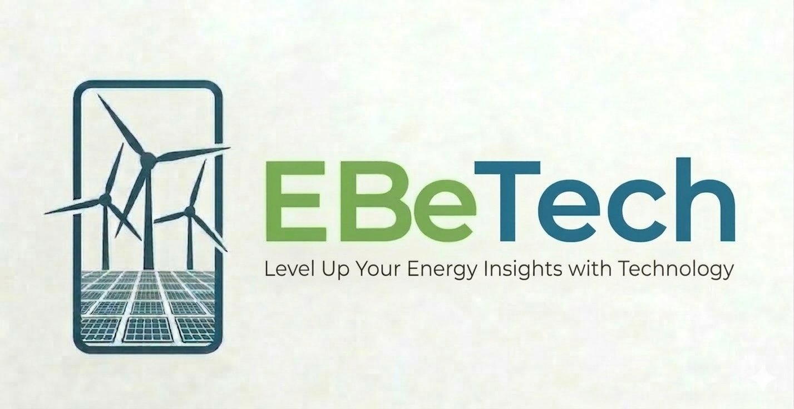

# EBeTech: Edukasi Bersama Energi Terbarukan Technology

## Institusi Teknologi Perusahaan Listrik Negara

## Anggota Tim

- **Ketua :** Farhan Alam Saputra
- **Anggota 1:** Rizal Wira Pambudi
- **Anggota 2:** Ahmad Izzulkamal

## Framework yang Digunakan

- **React** — UI framework utama
- **Vite** — Build tool & dev server
- **Three.js** + **@react-three/fiber** + **@react-three/drei** — Rendering animasi 3D
- **Framer Motion** — Animasi UI & transisi halaman
- **GSAP** — Animasi lanjutan berbasis timeline
- **Leaflet** + **React Leaflet** — Peta interaktif lokasi EBT
- **Lucide React** — Library ikon
- **ESLint** — Linting & code quality

## Tampilan Beranda

> Tampilan awal halaman **Beranda** saat website dijalankan. Halaman ini menyambut pengguna dengan antarmuka modern bertema energi terbarukan, dilengkapi dengan **6 kartu visual interaktif** di sisi kanan layar yang dapat **digeser dan diletakkan bebas** ke posisi mana saja sesuai keinginan pengguna — memberikan pengalaman eksplorasi yang personal dan dinamis.

## Filosofi Logo

Logo **EBeTech** dirancang bukan sekadar identitas visual, melainkan sebuah narasi filosofis yang merangkum visi besar di balik platform ini.

#### 1. Elemen Ikonografi dalam Frame

- **Kincir Angin _(Wind Turbines)_** — Melambangkan sumber energi terbarukan yang dinamis dan bersih. Secara filosofis, ini menunjukkan pergerakan maju, kemajuan teknologi, dan pemanfaatan kekuatan alam tanpa merusaknya.

- **Panel Surya _(Solar Panels)_** — Terletak di bagian bawah sebagai fondasi, melambangkan keberlanjutan dan kemandirian energi. Bentuk grid yang rapi mencerminkan efisiensi, struktur, dan presisi dalam pengolahan data atau teknologi.

- **Frame Kotak _(The Digital Interface)_** — Merepresentasikan layar perangkat Smartphone, yang menegaskan bahwa seluruh ekosistem teknologi ini berada dalam genggaman. Ini menunjukkan bahwa solusi energi yang ditawarkan bersifat _mobile-first_, dapat diakses kapan saja dan di mana saja secara instan. Kotak ini bukan sekadar pembatas, melainkan simbol kecanggihan aksesibilitas digital yang ringkas, terukur, dan terintegrasi dalam satu genggaman tangan.

#### 2. Filosofi Tipografi & Nama "EBeTech"

- **EBe** `(Hijau — #76A557)` — Warna hijau identik dengan pertumbuhan, alam _(eco-friendly)_, dan pembaruan. Penggunaan warna ini pada bagian depan nama menekankan bahwa inti dari platform ini adalah keberlanjutan lingkungan.

- **Tech** `(Biru — #277398)` — Warna biru melambangkan integritas, profesionalisme, dan kecerdasan digital. Ini menegaskan bahwa instrumen utama yang digunakan untuk mencapai visi lingkungan tersebut adalah teknologi canggih.

- **Perpaduan Dua Warna** — Menunjukkan keseimbangan yang harmonis antara aspek ekologi _(hijau)_ dan aspek industri/teknologi _(biru)_.

#### 3. Slogan: _"Level Up Your Energy Insights with Technology"_

Slogan ini bertindak sebagai janji brand. Kata **"Insights"** memberikan penekanan bahwa ini bukan sekadar alat fisik, melainkan solusi cerdas berbasis data yang membantu pengguna memahami dan mengoptimalkan penggunaan energi mereka ke tingkat yang lebih tinggi _(Level Up)_.

---

## Deskripsi Karya

**EBeTech** (kependekan dari _Edukasi Bersama Energi Terbarukan Technology_) merupakan sebuah inovasi _platform_ edukasi digital tentang lingkungan berbasis website interaktif yang dirancang khusus sebagai wadah sentral untuk menyosialisasikan, memetakan, dan merintis pemahaman masyarakat luas terhadap pentingnya transisi energi di Indonesia.

- **Latar Belakang:**
  Tingginya ketergantungan masyarakat dan industri terhadap bahan bakar fosil yang lambat laun memicu krisis iklim, berakar dari minimnya kesadaran kolektif serta sulitnya mengakses referensi yang mudah dipahami tentang potensi bersih Energi Baru Terbarukan (EBT) di Indonesia.

- **Tujuan:**
  Membangun sebuah ensiklopedia energi terbarukan visual yang modern dan interaktif. Website ini menargetkan percepatan literasi publik dengan mengupas tuntas anatomi rinci, skema cara kerja, keunggulan, serta pemetaan geospasial proyek percontohan pembangkit listrik EBT (PLTA, PLTS, PLTB, PLTP, PLTBM, Biomassa, dll) di berbagai belahan pulau di nusantara.

- **Manfaat:**
  Secara praktis, website ini dapat digunakan seketika oleh kalangan tenaga pendidik, mahasiswa, aparatur pemerintah, hingga masyarakat akar rumput sebagai basis data interaktif yang menyenangkan. Dilengkapi fitur _Glosarium EBT Pintar_ dan _Live Map Data Registration_, EBeTech memberikan asupan literasi yang dapat melahirkan calon-calon inovator lingkungan yang cerdas untuk mengawal masa depan Indonesia yang _Green_ dan _Sustainable_.

- **Pemilihan Subtema:**
  Karya ini dilandasi oleh urgensi digitalisasi dan pemanfaatan teknologi informasi untuk mendukung sektor ramah lingkungan, sehingga sangat relevan dengan subtema kebangkitan teknologi transisi energi / pembangunan berkelanjutan. _(Catatan: Silakan sesuaikan lagi kalimat subtema ini dengan nama subtema asli di buku panduan perlombaan/tugas Anda)._

## Link Website

https://ebetech.web.id/
